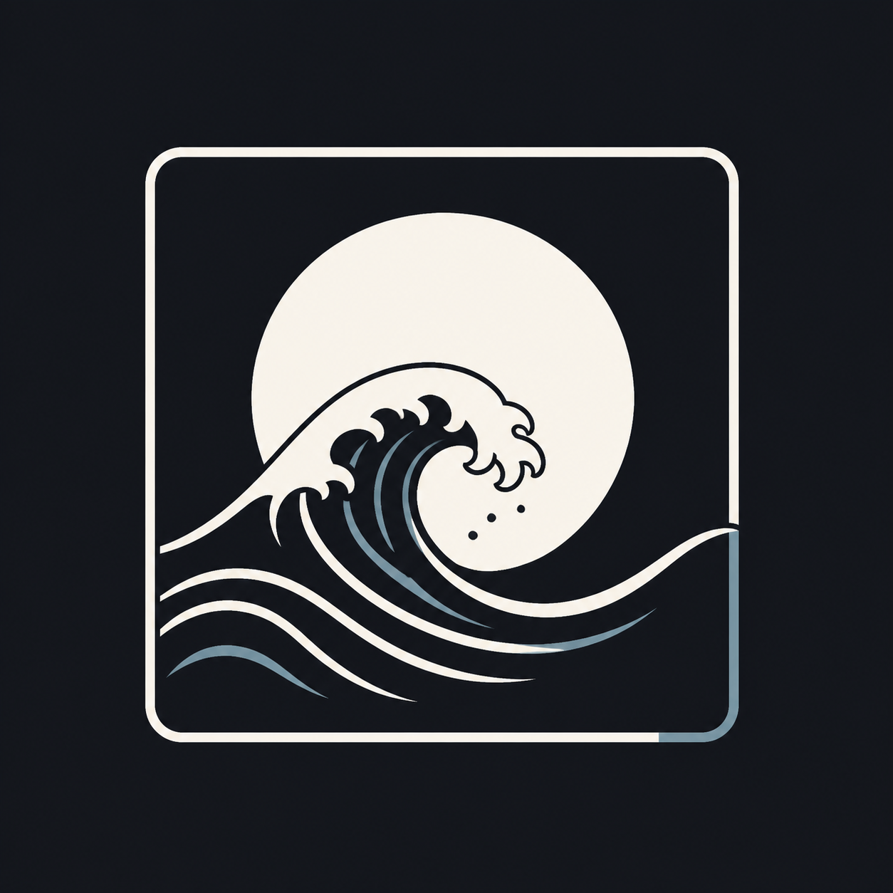
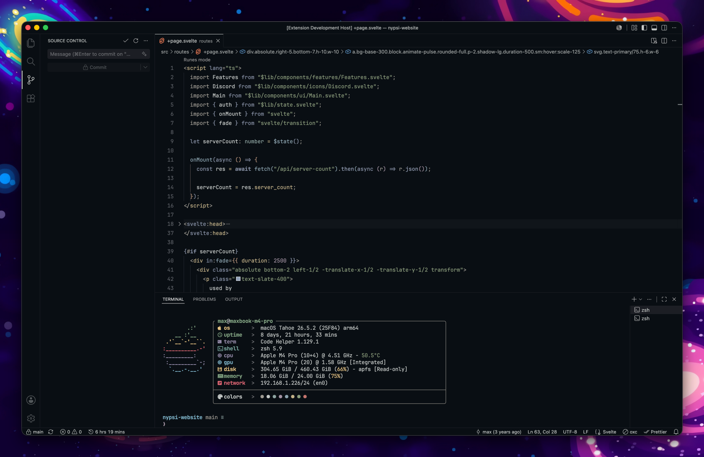
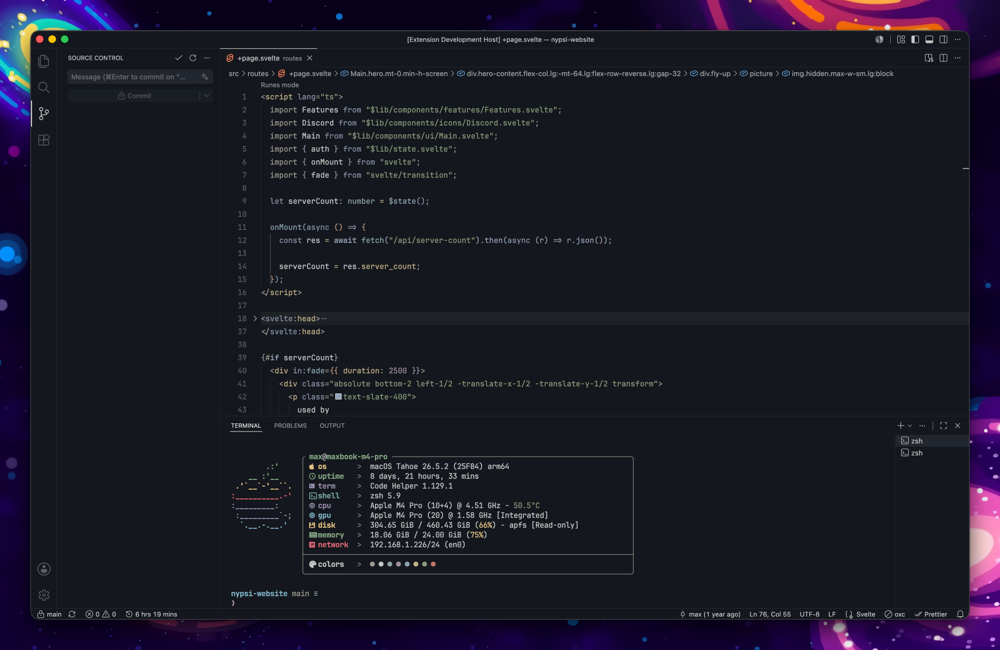
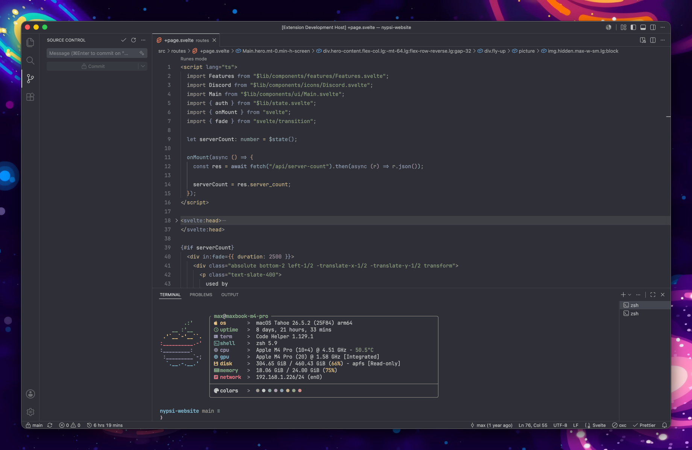
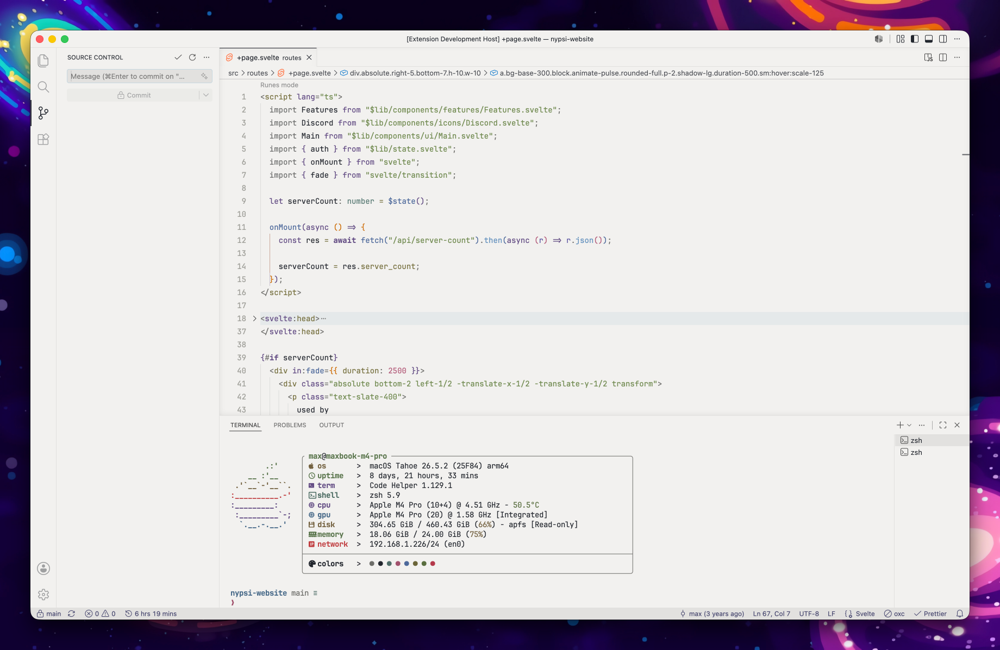

  

## Showcase

### Kanso Bordered Zen

### Kanso Bordered Ink

### Kanso Bordered Mist

### Kanso Bordered Pearl

## Credit

Forked from [webhooked/kanso-vscode](https://github.com/webhooked/kanso-vscode).
